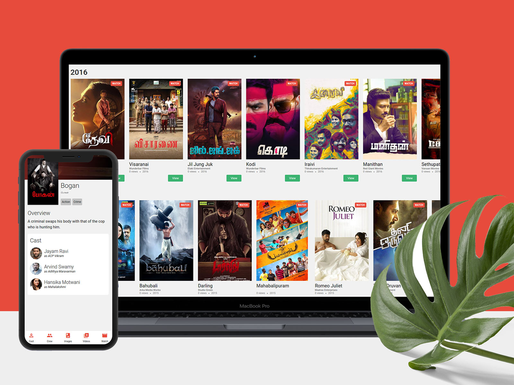

### Movie Streaming and Information website

[Source](https://dribbble.com/shots/11337951-Online-Movie-Portal) \
Simple Movie website created way back in 2017, i use to watch movies online using many websites avaialble, in which i use [tamilyogi](http://wwww.tamil_yogic.cc), were there will be quality of tamil movies updated. 

Certainly i got frustated with the ads that pops up inbetween while watching movie, some time time i use to inspect and remove most of the analtyics and click ads. I found out that it is also coming from that vide embed link.

At time i was learning Nodejs, i used this oppourtunity to scrap the website using Nodejs. I figured out how the HTML layouts have been structured and started to gather informations like 
- Title 
- Video Link
- Tags
- Year
- is it Dubbed ( that is framed from the title of movie )

#### Steps 1
I scrapped complete list of movies that available in that website. You can find the code in below location

```
./server/tamil_yogic.cc/get_movie_urls.js
```

and dumbed movies links .json in below location 

```
./server/tamil_yogic.cc/movies_url.json
```


### Step 2
Then i wrote a details scrapper where i gather informations as stated above. Worked on mongoSchema for defining a structure for document that has to be saved in the data base. You can find that inside the below path.

```
./server/tamil_yogic.cc/get_movie_detail.js
```


### How to Run this application in your local machine
Since this application was developed way back in 2016 - 2017, I have used certain tech stacks and library that are depreciated right now. 

- Node v7.30 
- Bower 

Create a .env file in the root directory with the below lines. Get your TMDB key by [clicking here](https://www.themoviedb.org/documentation/api) and update below.

```
TMDB_API_KEY=<TMDB_KEY>
```

After that run the below to link for dumping data. Make sure you have mongodb running locally

```
mongoimport --db movies_list_v2 --collection moviedetails --drop --file ./new_movie_details.json
mongoimport --db movies_list_v2 --collection homepages --drop --file ./new_home_page.json
```


Now you have sample details and all the movies details updated in your database. Go to root folder and 

```
npm start
```

You will able to see 

```
app listening on port 3003!
```

